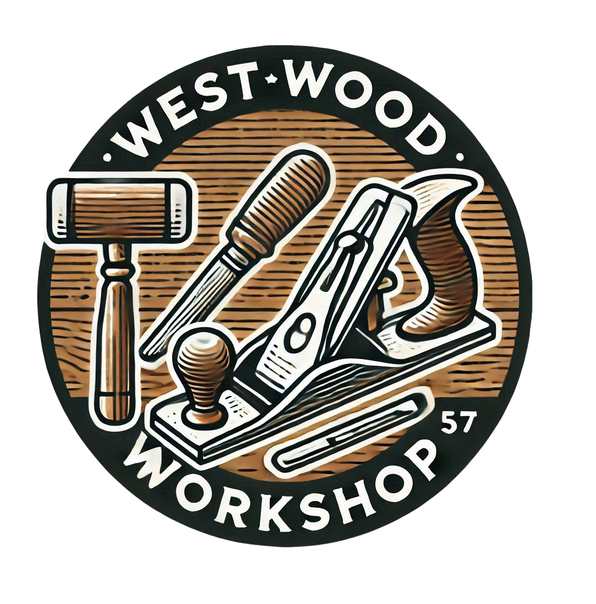

  

# Router table

The structure of the furniture has been made with pine battens section 69x69 mm for the "feet" 
and 44x70 mm for the low and high crosspieces. The tabletop dimension is 800 x 800 mm and it is in black Valchromat.
The router plate is dedicated to the Bosch POF 1400 ACE router. 
I bought it on Etsy by the company [UNI-LIFT Router](https://www.etsy.com/fr/shop/UNILIFTrouter) in Italy. The parallel guide was also manufactured by this company. 
In both cases, they are very beautiful fabrications. 
The parallel guide is a custom version 8000 x 800 mm and the size of the suction adapted to my needs.

Wood
* Pine Wood
* Valchromat: standard MDF stained in the mass for the tray
* OSB
* T-Track rail

Tools
* Table saw
* Handled power saw
* Router
* Orbital Sander

Joints
* Mortise and tenon

Finishing
* Varnish

|                                                                                                                           Router Table                                                                                                                            |
|:-----------------------------------------------------------------------------------------------------------------------------------------------------------------------------------------------------------------------------------------------------------------:|
|   | 
     

|                                         Router Table Insert Plate and  parallel Guide                                          |                                                           Parallel Guide                                                           |
|:------------------------------------------------------------------------------------------------------------------------------:|:----------------------------------------------------------------------------------------------------------------------------------:|
|  |  |  

