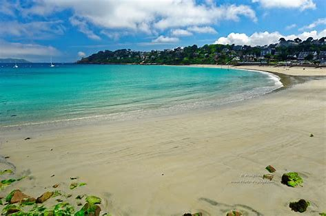
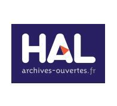
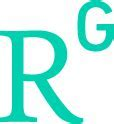

# Github Web Pages

## My Status : Currently retired

## Specialized in
* Artificial Intelligence : Knowledge Engineering, user/learner Models, Ontology and Reasoning, Semantic Web and Linked Data, Context Sensitivity and Adaptation
* Design of environments of learning and cultural mediation based on investigative approaches or connectivism, using social media in open environments of the MOOC type
  * In the fields of learning, lifelong learning and cultural heritage for formal and informal learning and the design of new computing environments to support researchers in History of Science and Technology - Digital Humanities.

## Websites & Social Networks

*  <a href="https://www.linkedin.com/in/sergegarlatti/" target="_blank" > My LinkedIn page </a>
*  <a href="https://www.imt-atlantique.fr/fr/personne/serge-garlatti" target="_blank" > Page personnelle IMT Atlantique </a>
*  <a href="https://cv.archives-ouvertes.fr/serge-garlatti" target="_blank" > CV HAL </a>
*  <a href="https://www.researchgate.net/profile/Serge-Garlatti" target="_blank" > Profil Researchgate </a>
*  <a href="https://scholar.google.fr/citations?view_op=list_works&hl=fr&user=yCdOUkUAAAAJ&gmla=AJsN-F4mAq6P6-KVZwH0xdTrWGOMPNylF17kmPamTpVtKMETOQYq3NsLYgnrtCyD9yfGnEsf-mLDGHS21FCEmocw8j3Po4YIT2-aBtx3d090iG4hJvnSRX7FSmTglHkyRBrAWAYMy6kQcCSEVlVCTKpAuL_AG94i5F2mYOT-s6Wfe_zmeg5oOFU" target="_blank" > Google Scholar </a>

## EDUCATION

* **2006** : HDR  in Computer Science, University of  Bretagne Sud
* **1990** : PHD in Computer Science, University of Rennes 2.
* **1980** : DEA in Computer Science, University of Rennes 2.
* **1978** : Postgraduate diploma in Electronic and Mechanics (Engineering school), l'Ecole Nationale d'Ingénieurs de Brest.

## PROFESSIONAL EXPERIENCE

* **01/2021-12/2023 :** Emeritus Professor, Computer Science Department
* **04/2020 - :** Full Professor, Computer Science Department
* **2015- 03/2020 :** Head of Computer Science Department
* **2006- :** Full Professor, Computer Science Department
* **2001-2006 :** Associated Professor, Artificial Intelligence and Cognitive Science Department
* **1986-2001 :** Assistant Professor, Artificial Intelligence and Cognitive Science Department.
* **1983 :** Reader, Computer Science and Network Department
* **1980 :** Engineer in a private company, Thomson CSF, CEBM.
