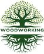

#  Home page

|                                          |
|:---------------------------------------------------------:|
|  |

# Introduction

The website is aiming at describing woodworking projects, 
the workshop organization and the different tools used in projects. 

The Website is written in [Markdown](https://www.markdownguide.org/){:target="_blank"} with 
[Jekyll](https://jekyllrb.com/){:target="_blank"} and powered by [GitHub Pages](https://pages.github.com/){:target="_blank"},
to describe the new life of a very busy retired guy. The responsive Jekyll theme 
used to design the website is called [Just the Docs](https://just-the-docs.com/){:target="_blank"}. 

